# Bidly Backend API 문서

> **행사 기획 대행사와 용역사를 연결하는 입찰 플랫폼 API**  
> Version: 1.0.0  
> 최종 업데이트: 2025년 6월 27일

## 📋 목차

1. [개요](#개요)
2. [인증](#인증)
3. [기본 정보](#기본-정보)
4. [API 엔드포인트](#api-엔드포인트)
   - [인증 API](#인증-api)
   - [RFP 관리 API](#rfp-관리-api)
   - [공고 관리 API](#공고-관리-api)
   - [제안서 관리 API](#제안서-관리-api)
   - [계약 관리 API](#계약-관리-api)
   - [스케줄 관리 API](#스케줄-관리-api)
   - [사용자 및 조직 관리 API](#사용자-및-조직-관리-api)
   - [심사위원 배정 관리 API](#심사위원-배정-관리-api)
   - [평가 관리 API](#평가-관리-api)
   - [단계별 평가 관리 API](#단계별-평가-관리-api)
   - [계약 미팅 관리 API](#계약-미팅-관리-api)
   - [알림 관리 API](#알림-관리-api)
   - [심사위원 추천 시스템 API](#심사위원-추천-시스템-api)
   - [요소 정의 API](#요소-정의-api)
5. [데이터베이스 관계도](#데이터베이스-관계도)
6. [데이터 모델 정의](#데이터-모델-정의)
7. [에러 처리](#에러-처리)
8. [개발 환경 설정](#개발-환경-설정)

---

## 개요

Bidly는 행사 기획 대행사와 용역사를 연결하는 입찰 플랫폼입니다. 이 API를 통해 RFP 생성, 공고 발행, 제안서 제출, 계약 관리 등의 모든 비즈니스 프로세스를 처리할 수 있습니다.

### 주요 기능
- 🏢 **대행사**: RFP 생성/수정, 공고 발행, 심사위원 배정, 제안서 평가, 계약 관리
- 🏭 **용역사**: 공고 조회, 제안서 제출, 계약 이행, 스케줄 관리
- 👨‍💼 **관리자**: 전체 시스템 관리, 사용자 관리, 평가 시스템 운영
- 🤖 **AI 추천**: 심사위원 전문성 분석 및 자동 추천 시스템

---

## 인증

### Bearer Token 인증
모든 API 요청(로그인 제외)에는 Authorization 헤더가 필요합니다.

```http
Authorization: Bearer {your_token_here}
```

### 사용자 타입
- `admin`: 시스템 관리자
- `agency_member`: 대행사 멤버
- `vendor_member`: 용역사 멤버

---

## 기본 정보

- **Base URL**: `http://localhost:8000`
- **Content-Type**: `application/json`
- **날짜 형식**: ISO 8601 (`2024-01-01T09:00:00Z`)
- **ID 형식**: UUID v4 (`01234567-89ab-cdef-0123-456789abcdef`)

---

## API 엔드포인트

## 인증 API

### 로그인
사용자 로그인 및 토큰 발급

```http
POST /api/login
```

**Request Body:**
```json
{
  "email": "admin@bidly.com",
  "password": "bidlyadmin123!"
}
```

**Response (200):**
```json
{
  "user": {
    "id": "01234567-89ab-cdef-0123-456789abcdef",
    "name": "관리자",
    "email": "admin@bidly.com",
    "user_type": "admin"
  },
  "token": "1|abcdefghijklmnopqrstuvwxyz",
  "message": "로그인 성공"
}
```

### 로그아웃
현재 토큰 폐기

```http
POST /api/logout
Authorization: Bearer {token}
```

**Response (200):**
```json
{
  "message": "로그아웃 성공"
}
```

### 현재 사용자 정보
인증된 사용자 정보 조회

```http
GET /api/user
Authorization: Bearer {token}
```

**Response (200):**
```json
{
  "user": {
    "id": "01234567-89ab-cdef-0123-456789abcdef",
    "name": "관리자",
    "email": "admin@bidly.com",
    "user_type": "admin"
  }
}
```

---

## RFP 관리 API

### RFP 생성
새로운 RFP(Request for Proposal) 생성 - 프로젝트와 RFP가 동시에 생성됩니다.

```http
POST /api/rfps
Authorization: Bearer {token}
```

**Request Body:**
```json
{
  "project_name": "2024 신년 행사",
  "start_datetime": "2024-02-01T09:00:00Z",
  "end_datetime": "2024-02-01T18:00:00Z",
  "preparation_start_datetime": "2024-01-30T08:00:00Z",
  "철수_end_datetime": "2024-02-02T12:00:00Z",
  "client_name": "ABC 회사",
  "client_contact_person": "김담당자",
  "client_contact_number": "010-1234-5678",
  "main_agency_contact_user_id": "01234567-89ab-cdef-0123-456789abcdef",
  "sub_agency_contact_user_id": "fedcba98-7654-3210-fedc-ba9876543210",
  "is_client_name_public": true,
  "is_budget_public": false,
  "is_indoor": true,
  "location": "서울시 강남구 코엑스",
  "budget_including_vat": 50000000,
  "issue_type": "integrated",
  "rfp_description": "신년 행사를 위한 종합 이벤트 기획",
  "closing_at": "2024-01-25T17:00:00Z",
  "elements": [
    {
      "element_type": "stage",
      "details": {
        "size": "10m x 8m",
        "height": "1.2m"
      },
      "allocated_budget": 10000000,
      "prepayment_ratio": 0.3,
      "prepayment_due_date": "2024-01-28",
      "balance_ratio": 0.7,
      "balance_due_date": "2024-02-05"
    }
  ]
}
```

**발주 타입 (issue_type):**
- `integrated`: 통합 발주
- `separated_by_element`: 요소별 분리 발주
- `separated_by_group`: 부분 묶음 발주

**새로 추가된 필드:**
- `main_agency_contact_user_id`: 주담당자 ID (선택사항, 미지정시 현재 사용자)
- `sub_agency_contact_user_id`: 부담당자 ID (선택사항)
- `is_client_name_public`: 클라이언트명 공개 여부 (기본값: true)
- `is_budget_public`: 예산 공개 여부 (기본값: false)

### RFP 목록 조회
대행사별 RFP 목록 조회 (페이지네이션)

```http
GET /api/rfps
Authorization: Bearer {token}
```

**Response (200):**
```json
{
  "message": "RFP 목록을 성공적으로 불러왔습니다.",
  "rfps": {
    "data": [
      {
        "id": "01234567-89ab-cdef-0123-456789abcdef",
        "current_status": "draft",
        "issue_type": "integrated",
        "closing_at": "2024-01-25T17:00:00Z",
        "is_client_name_public": true,
        "is_budget_public": false,
        "project": { /* 프로젝트 정보 */ },
        "elements": [ /* RFP 요소들 */ ]
      }
    ],
    "current_page": 1,
    "total": 25
  }
}
```

### RFP 상세 조회
특정 RFP 상세 정보 조회

```http
GET /api/rfps/{rfp_id}
Authorization: Bearer {token}
```

### RFP 수정
RFP가 '초안', '결재 대기', '반려' 상태일 때만 수정 가능

```http
PUT /api/rfps/{rfp_id}
Authorization: Bearer {token}
```

**Request Body:**
```json
{
  "project_name": "2024 신년 행사 (수정)",
  "start_datetime": "2024-02-01T10:00:00Z",
  "end_datetime": "2024-02-01T19:00:00Z",
  "rfp_description": "수정된 RFP 설명",
  "closing_at": "2024-01-26T17:00:00Z",
  "main_agency_contact_user_id": "new-contact-id",
  "is_client_name_public": false,
  "elements": [
    {
      "element_type": "stage",
      "details": {
        "size": "12m x 10m",
        "height": "1.5m"
      },
      "allocated_budget": 12000000
    }
  ]
}
```

**수정 가능한 상태:**
- `draft`: 초안
- `approval_pending`: 결재 대기
- `rejected`: 반려

### RFP 재결재 요청
수정된 RFP를 다시 결재 요청

```http
POST /api/rfps/{rfp_id}/resubmit
Authorization: Bearer {token}
```

**Response (200):**
```json
{
  "message": "RFP 재결재 요청이 성공적으로 제출되었습니다.",
  "rfp_status": "approval_pending"
}
```

---

## 공고 관리 API

### RFP 공고 발행
승인된 RFP를 입찰 공고로 발행

```http
POST /api/rfps/{rfp_id}/publish
Authorization: Bearer {token}
```

**Request Body:**
```json
{
  "closing_at": "2024-01-30T17:00:00Z",
  "estimated_price": 45000000,
  "channel_type": "public",
  "contact_info_private": false,
  "evaluation_criteria": {
    "price_weight": 40,
    "portfolio_weight": 35,
    "additional_weight": 25,
    "price_deduction_rate": 5,
    "price_rank_deduction_points": [10, 20, 30]
  },
  "evaluation_steps": [
    {
      "step_name": "서류심사",
      "start_date": "2024-01-31",
      "end_date": "2024-02-02",
      "send_notification": true
    },
    {
      "step_name": "발표심사",
      "start_date": "2024-02-05",
      "end_date": "2024-02-07",
      "send_notification": true
    },
    {
      "step_name": "최종심사",
      "start_date": "2024-02-10",
      "end_date": "2024-02-12",
      "send_notification": false
    }
  ]
}
```

**채널 타입:**
- `public`: 공용 채널 (모든 용역사 접근 가능)
- `agency_private`: 대행사 전용 채널 (승인된 용역사만 접근)

### 공고 목록 조회
입찰 공고 목록 조회

```http
GET /api/announcements
Authorization: Bearer {token}
```

**Response (200):**
```json
{
  "message": "입찰 공고 목록을 성공적으로 불러왔습니다.",
  "announcements": {
    "data": [
      {
        "id": "01234567-89ab-cdef-0123-456789abcdef",
        "title": "2024 신년 행사 - 무대 용역 입찰",
        "description": "신년 행사를 위한 종합 이벤트 기획...",
        "estimated_price": 45000000,
        "closing_at": "2024-01-30T17:00:00Z",
        "channel_type": "public",
        "status": "open",
        "rfp": { /* RFP 정보 */ },
        "agency": { /* 대행사 정보 */ }
      }
    ]
  }
}
```

### 공고 상세 조회
특정 공고 상세 정보 조회

```http
GET /api/announcements/{announcement_id}
Authorization: Bearer {token}
```

---

## 제안서 관리 API

### 제안서 제출
특정 공고에 제안서 제출 (용역사만 가능)

```http
POST /api/announcements/{announcement_id}/proposals
Authorization: Bearer {token}
```

**Request Body:**
```json
{
  "proposed_price": 42000000,
  "proposal_text": "저희 회사는 10년간의 무대 설치 경험을 바탕으로..."
}
```

### 제안서 목록 조회
공고별 제출된 제안서 목록 (대행사/관리자만)

```http
GET /api/announcements/{announcement_id}/proposals
Authorization: Bearer {token}
```

### 제안서 상세 조회
특정 제안서 상세 정보

```http
GET /api/proposals/{proposal_id}
Authorization: Bearer {token}
```

### 제안서 낙찰
제안서 낙찰 처리 (대행사/관리자만)

```http
POST /api/proposals/{proposal_id}/award
Authorization: Bearer {token}
```

**Request Body:**
```json
{
  "final_price": 40000000
}
```

### 제안서 유찰
제안서 유찰 처리

```http
POST /api/proposals/{proposal_id}/reject
Authorization: Bearer {token}
```

### 예비 순위 설정
제안서 예비 순위 설정 (자동 알림 발송)

```http
PATCH /api/proposals/{proposal_id}/set-reserve-rank
Authorization: Bearer {token}
```

**Request Body:**
```json
{
  "reserve_rank": 1
}
```

**Response (200):**
```json
{
  "message": "예비 순위가 성공적으로 설정되었습니다.",
  "proposal_id": "01234567-89ab-cdef-0123-456789abcdef",
  "reserve_rank": 1,
  "notification_sent": true
}
```

### 예비 제안서 승격
예비 제안서를 정식 낙찰자로 승격

```http
POST /api/proposals/{proposal_id}/promote-from-reserve
Authorization: Bearer {token}
```

---

## 계약 관리 API

### 계약 목록 조회
계약 목록 조회

```http
GET /api/contracts
Authorization: Bearer {token}
```

### 계약 상세 조회
특정 계약 상세 정보

```http
GET /api/contracts/{contract_id}
Authorization: Bearer {token}
```

### 계약 결제 상태 업데이트
계약의 결제 상태 업데이트

```http
PATCH /api/contracts/{contract_id}/update-payment-status
Authorization: Bearer {token}
```

**Request Body:**
```json
{
  "payment_status": "prepayment_paid"
}
```

**결제 상태:**
- `pending`: 대기 중
- `prepayment_paid`: 선금 지급됨
- `balance_paid`: 잔금 지급됨
- `all_paid`: 모두 지급됨

---

## 스케줄 관리 API

### 스케줄 목록 조회
사용자별, 기간별, 타입별로 스케줄 목록 조회

```http
GET /api/schedules
Authorization: Bearer {token}
```

**Query Parameters:**
- `schedulable_type`: 스케줄 타입 (App\Models\Project, App\Models\Announcement, App\Models\Contract)
- `schedulable_id`: 스케줄 대상 ID
- `start_date`: 조회 시작 날짜 (YYYY-MM-DD)
- `end_date`: 조회 종료 날짜 (YYYY-MM-DD)
- `my_schedules_only`: 내 일정만 조회 (true/false)
- `type`: 스케줄 활동 타입 (meeting, site_visit, preparation 등)

**Response (200):**
```json
{
  "message": "스케줄 목록을 성공적으로 불러왔습니다.",
  "schedules": [
    {
      "id": "01234567-89ab-cdef-0123-456789abcdef",
      "title": "무대 설치",
      "description": "메인 무대 설치 작업",
      "scheduled_at": "2024-02-01T08:00:00Z",
      "type": "installation",
      "status": "planned",
      "schedulable_type": "App\\Models\\Project",
      "schedulable_id": "project-id",
      "attachments_count": 2
    }
  ],
  "total_count": 15
}
```

### 내 일정 조회
현재 사용자와 관련된 모든 일정 조회 (대시보드용)

```http
GET /api/my-schedules
Authorization: Bearer {token}
```

**Query Parameters:**
- `start_date`: 조회 시작 날짜 (YYYY-MM-DD)
- `end_date`: 조회 종료 날짜 (YYYY-MM-DD)

**Response (200):**
```json
{
  "message": "내 일정을 성공적으로 불러왔습니다.",
  "schedules": [
    {
      "id": "01234567-89ab-cdef-0123-456789abcdef",
      "title": "무대 설치 회의",
      "scheduled_at": "2024-02-01T09:00:00Z",
      "type": "meeting",
      "status": "planned",
      "related_project": "2024 신년 행사",
      "my_role": "주담당자"
    }
  ],
  "total_count": 8
}
```

**내 역할 타입:**
- `주담당자`: 프로젝트 주담당자
- `부담당자`: 프로젝트 부담당자
- `심사위원`: 공고 심사위원
- `대행사 담당자`: 계약 관련 대행사 담당자
- `용역사 담당자`: 계약 관련 용역사 담당자

### 스케줄 생성
새 스케줄 생성

```http
POST /api/schedules
Authorization: Bearer {token}
```

**Request Body:**
```json
{
  "schedulable_type": "App\\Models\\Project",
  "schedulable_id": "01234567-89ab-cdef-0123-456789abcdef",
  "title": "무대 설치",
  "description": "메인 무대 설치 작업",
  "start_datetime": "2024-02-01T08:00:00Z",
  "end_datetime": "2024-02-01T12:00:00Z",
  "location": "코엑스 홀 A",
  "status": "planned",
  "type": "installation"
}
```

**스케줄 타입:**
- `meeting`, `delivery`, `installation`, `dismantling`, `rehearsal`
- `event_execution`, `setup`, `testing`, `load_in`, `load_out`
- `storage`, `breakdown`, `cleaning`, `training`, `briefing`
- `pickup`, `transportation`, `site_visit`, `concept_meeting`
- `technical_rehearsal`, `dress_rehearsal`, `final_inspection`, `wrap_up`

### 스케줄 상세 조회
특정 스케줄 상세 정보

```http
GET /api/schedules/{schedule_id}
Authorization: Bearer {token}
```

### 스케줄 수정
스케줄 정보 수정

```http
PUT /api/schedules/{schedule_id}
Authorization: Bearer {token}
```

### 스케줄 삭제
스케줄 삭제

```http
DELETE /api/schedules/{schedule_id}
Authorization: Bearer {token}
```

### 스케줄 첨부파일 업로드
스케줄에 파일 첨부

```http
POST /api/schedules/{schedule_id}/attachments
Authorization: Bearer {token}
Content-Type: multipart/form-data
```

**Form Data:**
- `file`: 업로드할 파일 (이미지, 최대 10MB)

### 스케줄 첨부파일 목록
스케줄의 첨부파일 목록 조회

```http
GET /api/schedules/{schedule_id}/attachments
Authorization: Bearer {token}
```

### 첨부파일 다운로드
첨부파일 다운로드

```http
GET /api/schedule-attachments/{attachment_id}
Authorization: Bearer {token}
```

### 첨부파일 삭제
첨부파일 삭제

```http
DELETE /api/schedule-attachments/{attachment_id}
Authorization: Bearer {token}
```

---

## 사용자 및 조직 관리 API

### 대행사 멤버 목록 조회
현재 사용자 소속 대행사의 멤버 목록 조회 (심사위원 배정 시 활용)

```http
GET /api/agency-members?include_expertise=true
Authorization: Bearer {token}
```

**Query Parameters:**
- `include_expertise`: 전문성 정보 포함 여부 (boolean)

**Response (200):**
```json
{
  "message": "대행사 멤버 목록을 성공적으로 불러왔습니다.",
  "members": [
    {
      "id": "01234567-89ab-cdef-0123-456789abcdef",
      "name": "김직원",
      "email": "employee@agency.com",
      "phone_number": "010-1234-5678",
      "expertise": [
        {
          "element_type": "stage",
          "evaluation_count": 15,
          "avg_score": 85.5,
          "expertise_level": "전문가"
        }
      ]
    }
  ],
  "total_count": 12
}
```

### 대행사 목록 조회
시스템에 등록된 대행사 목록 조회 (관리자만)

```http
GET /api/agencies
Authorization: Bearer {token}
```

### 용역사 목록 조회
시스템에 등록된 용역사 목록 조회 (관리자만)

```http
GET /api/vendors
Authorization: Bearer {token}
```

---

## 심사위원 배정 관리 API

### 프로젝트 전체 심사위원 배정
프로젝트와 연결된 모든 현재 및 미래 공고에 심사위원 배정

```http
POST /api/projects/{project_id}/assign-evaluators
Authorization: Bearer {token}
```

**Request Body:**
```json
{
  "evaluator_user_ids": [
    "01234567-89ab-cdef-0123-456789abcdef",
    "fedcba98-7654-3210-fedc-ba9876543210"
  ],
  "assignment_type": "designated"
}
```

**배정 타입:**
- `designated`: 지정 배정
- `random`: 랜덤 배정

### RFP 전체 심사위원 배정
RFP와 연결된 모든 현재 및 미래 공고에 심사위원 배정

```http
POST /api/rfps/{rfp_id}/assign-evaluators
Authorization: Bearer {token}
```

### 개별 공고 심사위원 배정
특정 공고에만 심사위원 배정

```http
POST /api/announcements/{announcement_id}/assign-evaluators
Authorization: Bearer {token}
```

### 프로젝트 연결 공고 목록
특정 프로젝트와 연결된 모든 공고 목록 조회

```http
GET /api/projects/{project_id}/announcements
Authorization: Bearer {token}
```

### RFP 연결 공고 목록
특정 RFP와 연결된 모든 공고 목록 조회

```http
GET /api/rfps/{rfp_id}/announcements
Authorization: Bearer {token}
```

---

## 평가 관리 API

### 점수 제출
제안서에 평가 점수 제출

```http
POST /api/proposals/{proposal_id}/evaluations
Authorization: Bearer {token}
```

**Request Body:**
```json
{
  "price_score": 85.5,
  "portfolio_score": 90.0,
  "additional_score": 88.0,
  "evaluation_comment": "우수한 제안서입니다."
}
```

### 평가 현황 조회
공고별 평가 현황 조회

```http
GET /api/announcements/{announcement_id}/evaluation-status
Authorization: Bearer {token}
```

**Response (200):**
```json
{
  "message": "평가 현황을 성공적으로 불러왔습니다.",
  "announcement": {
    "id": "announcement-id",
    "title": "무대 설치 공고"
  },
  "evaluation_summary": {
    "total_evaluators": 3,
    "completed_evaluations": 2,
    "completion_rate": 66.67
  },
  "proposal_evaluations": [
    {
      "proposal_id": "proposal-id",
      "vendor_name": "ABC 무대",
      "proposed_price": 10000000,
      "evaluations_completed": 2,
      "average_total_score": 87.5
    }
  ]
}
```

---

## 단계별 평가 관리 API

### 평가 단계별 결과 처리
각 평가 단계의 통과/탈락 여부를 기록하고 용역사에게 알림 발송

```http
POST /api/announcements/{announcement}/evaluate-step
Authorization: Bearer {token}
```

**Request Body:**
```json
{
  "step_name": "서류심사",
  "passed_proposal_ids": [
    "01234567-89ab-cdef-0123-456789abcdef",
    "fedcba98-7654-3210-fedc-ba9876543210"
  ],
  "failed_proposal_ids": [
    "11111111-2222-3333-4444-555555555555"
  ]
}
```

**Response (200):**
```json
{
  "message": "서류심사 단계 평가 결과가 성공적으로 처리되었습니다.",
  "step_name": "서류심사",
  "passed_count": 2,
  "failed_count": 1,
  "notifications_sent": 3
}
```

### 발표 순서 랜덤 배정
통과한 제안서들에 대해 발표 순서를 랜덤으로 배정

```http
POST /api/announcements/{announcement}/randomize-proposal-order
Authorization: Bearer {token}
```

**Request Body:**
```json
{
  "proposal_ids": [
    "01234567-89ab-cdef-0123-456789abcdef",
    "fedcba98-7654-3210-fedc-ba9876543210"
  ]
}
```

**Response (200):**
```json
{
  "message": "발표 순서가 성공적으로 배정되었습니다.",
  "proposal_orders": [
    {
      "proposal_id": "fedcba98-7654-3210-fedc-ba9876543210",
      "presentation_order": 1
    },
    {
      "proposal_id": "01234567-89ab-cdef-0123-456789abcdef",
      "presentation_order": 2
    }
  ]
}
```

### 발표 일정 생성
발표 순서가 배정된 제안서들에 대해 발표 일정을 생성

```http
POST /api/announcements/{announcement}/schedule-presentations
Authorization: Bearer {token}
```

**Request Body:**
```json
{
  "start_datetime": "2024-02-05T09:00:00Z",
  "duration_per_presentation": 30,
  "break_duration": 10
}
```

**Response (200):**
```json
{
  "message": "발표 일정이 성공적으로 생성되었습니다.",
  "schedules_created": 2,
  "presentation_schedules": [
    {
      "proposal_id": "fedcba98-7654-3210-fedc-ba9876543210",
      "presentation_order": 1,
      "scheduled_at": "2024-02-05T09:00:00Z",
      "duration_minutes": 30
    },
    {
      "proposal_id": "01234567-89ab-cdef-0123-456789abcdef",
      "presentation_order": 2,
      "scheduled_at": "2024-02-05T09:40:00Z",
      "duration_minutes": 30
    }
  ]
}
```

---

## 계약 미팅 관리 API

### 미팅 일정 제안
낙찰 후 용역사와의 미팅 일정 제안

```http
POST /api/contracts/{contract}/propose-meeting-dates
Authorization: Bearer {token}
```

**Request Body:**
```json
{
  "proposed_dates": [
    "2024-02-10T14:00:00Z",
    "2024-02-11T10:00:00Z",
    "2024-02-12T16:00:00Z"
  ]
}
```

**Response (200):**
```json
{
  "message": "미팅 일정이 성공적으로 제안되었습니다.",
  "contract_id": "01234567-89ab-cdef-0123-456789abcdef",
  "proposed_dates": [
    "2024-02-10T14:00:00Z",
    "2024-02-11T10:00:00Z",
    "2024-02-12T16:00:00Z"
  ],
  "meeting_status": "dates_proposed"
}
```

### 미팅 일정 선택
제안된 미팅 일정 중 하나를 선택

```http
PATCH /api/contracts/{contract}/select-meeting-date
Authorization: Bearer {token}
```

**Request Body:**
```json
{
  "selected_date": "2024-02-11T10:00:00Z"
}
```

**Response (200):**
```json
{
  "message": "미팅 일정이 성공적으로 선택되었습니다.",
  "contract_id": "01234567-89ab-cdef-0123-456789abcdef",
  "selected_meeting_date": "2024-02-11T10:00:00Z",
  "meeting_status": "scheduled",
  "schedule_created": true
}
```

### 미팅 상태 조회
계약의 미팅 상태 및 일정 조회

```http
GET /api/contracts/{contract}/meeting-status
Authorization: Bearer {token}
```

**Response (200):**
```json
{
  "message": "미팅 상태를 성공적으로 불러왔습니다.",
  "contract_id": "01234567-89ab-cdef-0123-456789abcdef",
  "meeting_status": "scheduled",
  "proposed_meeting_dates": [
    "2024-02-10T14:00:00Z",
    "2024-02-11T10:00:00Z",
    "2024-02-12T16:00:00Z"
  ],
  "selected_meeting_date": "2024-02-11T10:00:00Z"
}
```

**미팅 상태:**
- `pending`: 미팅 일정 미정
- `dates_proposed`: 일정 제안됨
- `scheduled`: 일정 확정됨
- `completed`: 미팅 완료

---

## 알림 관리 API

### 알림 목록 조회
사용자의 알림 목록 조회 (페이지네이션)

```http
GET /api/notifications
Authorization: Bearer {token}
```

**Query Parameters:**
- `page`: 페이지 번호 (기본값: 1)
- `per_page`: 페이지당 개수 (기본값: 15, 최대: 50)
- `unread_only`: 읽지 않은 알림만 조회 (true/false)

**Response (200):**
```json
{
  "message": "알림 목록을 성공적으로 불러왔습니다.",
  "notifications": {
    "data": [
      {
        "id": "01234567-89ab-cdef-0123-456789abcdef",
        "type": "evaluation_step_passed",
        "title": "서류심사 통과",
        "message": "2024 신년 행사 - 무대 용역 입찰의 서류심사를 통과하셨습니다.",
        "data": {
          "announcement_id": "announcement-id",
          "step_name": "서류심사"
        },
        "read_at": null,
        "created_at": "2024-02-01T10:00:00Z"
      }
    ],
    "current_page": 1,
    "total": 25,
    "unread_count": 5
  }
}
```

### 읽지 않은 알림 개수
사용자의 읽지 않은 알림 개수 조회

```http
GET /api/notifications/unread-count
Authorization: Bearer {token}
```

**Response (200):**
```json
{
  "unread_count": 5
}
```

### 알림 읽음 처리
특정 알림을 읽음으로 표시

```http
PATCH /api/notifications/{notification}/read
Authorization: Bearer {token}
```

**Response (200):**
```json
{
  "message": "알림이 읽음으로 처리되었습니다.",
  "notification_id": "01234567-89ab-cdef-0123-456789abcdef"
}
```

### 모든 알림 읽음 처리
사용자의 모든 알림을 읽음으로 표시

```http
PATCH /api/notifications/mark-all-read
Authorization: Bearer {token}
```

**Response (200):**
```json
{
  "message": "모든 알림이 읽음으로 처리되었습니다.",
  "marked_count": 15
}
```

### 알림 상세 조회
특정 알림의 상세 정보 조회

```http
GET /api/notifications/{notification}
Authorization: Bearer {token}
```

**Response (200):**
```json
{
  "message": "알림 상세 정보를 성공적으로 불러왔습니다.",
  "notification": {
    "id": "01234567-89ab-cdef-0123-456789abcdef",
    "type": "meeting_date_proposed",
    "title": "미팅 일정 제안",
    "message": "계약 관련 미팅 일정이 제안되었습니다.",
    "data": {
      "contract_id": "contract-id",
      "proposed_dates": [
        "2024-02-10T14:00:00Z",
        "2024-02-11T10:00:00Z"
      ]
    },
    "read_at": null,
    "created_at": "2024-02-01T10:00:00Z"
  }
}
```

### 알림 삭제
특정 알림 삭제

```http
DELETE /api/notifications/{notification}
Authorization: Bearer {token}
```

**Response (200):**
```json
{
  "message": "알림이 성공적으로 삭제되었습니다."
}
```

**알림 타입:**
- `new_bid_available`: 새로운 입찰 공고
- `proposal_submitted`: 제안서 제출됨
- `rfp_approved`: RFP 승인됨
- `rfp_rejected`: RFP 반려됨
- `contract_status_update`: 계약 상태 업데이트
- `announcement_closed`: 공고 마감
- `evaluation_step_passed`: 평가 단계 통과
- `evaluation_step_failed`: 평가 단계 탈락
- `reserve_rank_assigned`: 예비 순위 부여
- `meeting_date_proposed`: 미팅 일정 제안
- `meeting_date_selected`: 미팅 일정 선택

---

## 심사위원 추천 시스템 API

### 요소별 심사위원 추천
특정 요소(무대, 음향, 조명 등)에 대한 경험 많은 심사위원 추천

```http
GET /api/evaluators/recommendations/{element_type}
Authorization: Bearer {token}
```

**Path Parameters:**
- `element_type`: 요소 타입 (`stage`, `sound`, `lighting`, `casting`, `security`, `video`, `photo`, `electric`, `transport`, `printing`, `LED_screen`, `equipment_rental`)

**Query Parameters:**
- `limit`: 추천할 심사위원 수 (기본값: 5, 최대: 20)

**Response (200):**
```json
{
  "message": "무대 요소 심사위원 추천 목록입니다.",
  "element_type": "stage",
  "recommendations": [
    {
      "user_id": "01234567-89ab-cdef-0123-456789abcdef",
      "name": "김심사",
      "email": "evaluator@agency.com",
      "evaluation_count": 15,
      "avg_score": 85.5,
      "expertise_level": "전문가",
      "last_evaluation_date": "2024-01-15"
    }
  ]
}
```

**전문성 레벨:**
- `전문가`: 20회 이상 평가, 평균 85점 이상
- `숙련자`: 10회 이상 평가, 평균 80점 이상
- `경험자`: 5회 이상 평가, 평균 75점 이상
- `초보자`: 그 외

### 심사위원 전문성 분석
특정 심사위원의 요소별 평가 경험 및 전문성 분석

```http
GET /api/evaluators/{user_id}/expertise
Authorization: Bearer {token}
```

**Response (200):**
```json
{
  "message": "심사위원 전문성 분석 결과입니다.",
  "evaluator": {
    "id": "01234567-89ab-cdef-0123-456789abcdef",
    "name": "김심사",
    "email": "evaluator@agency.com"
  },
  "expertise": [
    {
      "element_type": "stage",
      "element_name": "무대",
      "evaluation_count": 15,
      "avg_score": 85.5,
      "expertise_level": "전문가",
      "last_evaluation_at": "2024-01-15"
    },
    {
      "element_type": "sound",
      "element_name": "음향",
      "evaluation_count": 8,
      "avg_score": 82.3,
      "expertise_level": "경험자",
      "last_evaluation_at": "2024-01-10"
    }
  ]
}
```

### 심사위원 통계 현황
대행사별 심사위원 활동 통계 및 요소별 전문가 현황

```http
GET /api/evaluators/statistics
Authorization: Bearer {token}
```

**Response (200):**
```json
{
  "message": "심사위원 통계 현황입니다.",
  "statistics": {
    "total_evaluators": 25,
    "active_evaluators": 18,
    "total_evaluations": 342,
    "element_experts": [
      {
        "element_type": "stage",
        "element_name": "무대",
        "expert_count": 5,
        "total_evaluations": 87
      },
      {
        "element_type": "sound",
        "element_name": "음향",
        "expert_count": 4,
        "total_evaluations": 62
      }
    ]
  }
}
```

**통계 설명:**
- `total_evaluators`: 전체 심사위원 수
- `active_evaluators`: 최근 6개월 내 활동한 심사위원 수
- `total_evaluations`: 완료된 총 평가 수
- `element_experts`: 요소별 전문가 현황

**추천 시스템 특징:**
- 평가 횟수와 평균 점수를 기반으로 순위 결정
- 같은 대행사 소속 제한
- 최근 6개월 내 활동 이력 우선 고려
- 요소별 전문가 현황 통계 제공

---

## 요소 정의 API

### 요소 정의 목록
RFP 요소 정의 목록 조회

```http
GET /api/element-definitions
Authorization: Bearer {token}
```

### 요소 정의 생성
새 요소 정의 생성 (관리자만)

```http
POST /api/element-definitions
Authorization: Bearer {token}
```

### 요소 정의 수정
요소 정의 수정 (관리자만)

```http
PUT /api/element-definitions/{element_id}
Authorization: Bearer {token}
```

### 요소 정의 삭제
요소 정의 삭제 (관리자만)

```http
DELETE /api/element-definitions/{element_id}
Authorization: Bearer {token}
```

---

## 데이터베이스 관계도

```mermaid
erDiagram
    USERS {
        uuid id PK
        string email UK
        string password
        string name
        string phone_number
        USER_TYPE_ENUM user_type
        timestamp created_at
        timestamp updated_at
    }
    
    AGENCIES {
        uuid id PK
        string name
        string business_registration_number UK
        text address
        uuid master_user_id FK
        SUBSCRIPTION_STATUS_ENUM subscription_status
        timestamp subscription_end_date
        timestamp created_at
        timestamp updated_at
    }
    
    VENDORS {
        uuid id PK
        string name
        string business_registration_number UK
        text address
        uuid master_user_id FK
        VENDOR_ACCOUNT_STATUS_ENUM account_status
        timestamp created_at
        timestamp updated_at
    }
    
    AGENCY_MEMBERS {
        uuid id PK
        uuid agency_id FK
        uuid user_id FK
        timestamp created_at
        timestamp updated_at
    }
    
    VENDOR_MEMBERS {
        uuid id PK
        uuid vendor_id FK
        uuid user_id FK
        timestamp created_at
        timestamp updated_at
    }
    
    PROJECTS {
        uuid id PK
        string project_name
        datetime start_datetime
        datetime end_datetime
        datetime preparation_start_datetime
        datetime teardown_end_datetime
        string client_name
        string client_contact_person
        string client_contact_number
        uuid main_agency_contact_user_id FK
        uuid sub_agency_contact_user_id FK
        uuid agency_id FK
        boolean is_indoor
        string location
        decimal budget_including_vat
        timestamp created_at
        timestamp updated_at
    }
    
    RFPS {
        uuid id PK
        uuid project_id FK
        RFP_STATUS_ENUM current_status
        uuid created_by_user_id FK
        uuid agency_id FK
        RFP_ISSUE_TYPE_ENUM issue_type
        text rfp_description
        datetime closing_at
        datetime published_at
        boolean is_client_name_public
        boolean is_budget_public
        timestamp created_at
        timestamp updated_at
    }
    
    ELEMENT_DEFINITIONS {
        uuid id PK
        string element_type
        string element_name
        text description
        boolean is_active
        timestamp created_at
        timestamp updated_at
    }
    
    RFP_ELEMENTS {
        uuid id PK
        uuid rfp_id FK
        string element_type
        json details
        decimal allocated_budget
        decimal prepayment_ratio
        date prepayment_due_date
        decimal balance_ratio
        date balance_due_date
        timestamp created_at
        timestamp updated_at
    }
    
    ANNOUNCEMENTS {
        uuid id PK
        uuid rfp_id FK
        uuid rfp_element_id FK
        uuid agency_id FK
        string title
        text description
        decimal estimated_price
        datetime closing_at
        ANNOUNCEMENT_CHANNEL_TYPE_ENUM channel_type
        boolean contact_info_private
        timestamp published_at
        ANNOUNCEMENT_STATUS_ENUM status
        json evaluation_criteria
        timestamp created_at
        timestamp updated_at
    }
    
    PROPOSALS {
        uuid id PK
        uuid announcement_id FK
        uuid vendor_id FK
        decimal proposed_price
        text proposal_text
        string proposal_file_path
        PROPOSAL_STATUS_ENUM status
        integer reserve_rank
        timestamp submitted_at
        timestamp created_at
        timestamp updated_at
    }
    
    CONTRACTS {
        uuid id PK
        uuid announcement_id FK
        uuid proposal_id FK
        uuid vendor_id FK
        decimal final_price
        string contract_file_path
        timestamp contract_signed_at
        decimal prepayment_amount
        timestamp prepayment_paid_at
        decimal balance_amount
        timestamp balance_paid_at
        PAYMENT_STATUS_ENUM payment_status
        timestamp created_at
        timestamp updated_at
    }
    
    SCHEDULES {
        uuid id PK
        string schedulable_type
        uuid schedulable_id
        string title
        text description
        datetime start_datetime
        datetime end_datetime
        string location
        SCHEDULE_STATUS_ENUM status
        SCHEDULE_ACTIVITY_TYPE_ENUM type
        timestamp created_at
        timestamp updated_at
    }
    
    SCHEDULE_ATTACHMENTS {
        uuid id PK
        uuid schedule_id FK
        string filename
        string original_filename
        string file_path
        string mime_type
        bigint file_size
        timestamp created_at
        timestamp updated_at
    }
    
    EVALUATIONS {
        uuid id PK
        uuid proposal_id FK
        uuid evaluator_user_id FK
        decimal price_score
        decimal portfolio_score
        decimal additional_score
        decimal total_score
        text evaluation_comment
        timestamp submitted_at
        timestamp created_at
        timestamp updated_at
    }
    
    ANNOUNCEMENT_EVALUATORS {
        uuid id PK
        uuid announcement_id FK
        uuid evaluator_user_id FK
        EVALUATOR_ASSIGNMENT_TYPE_ENUM assignment_type
        SCOPE_TYPE_ENUM scope_type
        timestamp assigned_at
        timestamp created_at
        timestamp updated_at
    }

    EVALUATOR_HISTORIES {
        uuid id PK
        uuid evaluator_user_id FK
        uuid announcement_id FK
        uuid proposal_id FK
        string element_type
        uuid project_id FK
        string project_name
        decimal evaluation_score
        boolean evaluation_completed
        timestamp evaluation_completed_at
        text evaluation_notes
        timestamp created_at
        timestamp updated_at
    }

    USERS ||--o{ AGENCY_MEMBERS : "belongs to"
    USERS ||--o{ VENDOR_MEMBERS : "belongs to"
    USERS ||--o{ AGENCIES : "masters"
    USERS ||--o{ VENDORS : "masters"
    USERS ||--o{ PROJECTS : "main contact"
    USERS ||--o{ PROJECTS : "sub contact"
    USERS ||--o{ RFPS : "creates"
    USERS ||--o{ EVALUATIONS : "evaluates"
    USERS ||--o{ ANNOUNCEMENT_EVALUATORS : "assigned"
    
    AGENCIES ||--o{ AGENCY_MEMBERS : "has"
    AGENCIES ||--o{ PROJECTS : "owns"
    AGENCIES ||--o{ RFPS : "creates"
    AGENCIES ||--o{ ANNOUNCEMENTS : "publishes"
    
    VENDORS ||--o{ VENDOR_MEMBERS : "has"
    VENDORS ||--o{ PROPOSALS : "submits"
    VENDORS ||--o{ CONTRACTS : "signs"
    
    PROJECTS ||--|| RFPS : "has"
    PROJECTS ||--o{ SCHEDULES : "has"
    PROJECTS ||--o{ EVALUATOR_HISTORIES : "evaluated in"
    
    RFPS ||--o{ RFP_ELEMENTS : "contains"
    RFPS ||--o{ ANNOUNCEMENTS : "becomes"
    
    ELEMENT_DEFINITIONS ||--o{ RFP_ELEMENTS : "defines"
    
    RFP_ELEMENTS ||--o{ ANNOUNCEMENTS : "published as"
    
    ANNOUNCEMENTS ||--o{ PROPOSALS : "receives"
    ANNOUNCEMENTS ||--o{ CONTRACTS : "results in"
    ANNOUNCEMENTS ||--o{ ANNOUNCEMENT_EVALUATORS : "has"
    ANNOUNCEMENTS ||--o{ SCHEDULES : "has"
    ANNOUNCEMENTS ||--o{ EVALUATOR_HISTORIES : "evaluated for"
    
    PROPOSALS ||--|| CONTRACTS : "becomes"
    PROPOSALS ||--o{ EVALUATIONS : "receives"
    PROPOSALS ||--o{ EVALUATOR_HISTORIES : "evaluated in"
    
    SCHEDULES ||--o{ SCHEDULE_ATTACHMENTS : "has"
    
    EVALUATOR_HISTORIES ||--|| USERS : "performed by"
    EVALUATOR_HISTORIES ||--|| ANNOUNCEMENTS : "for"
    EVALUATOR_HISTORIES ||--|| PROPOSALS : "on"
    EVALUATOR_HISTORIES ||--|| PROJECTS : "in"
```



---

## 데이터 모델 정의

### 🔑 핵심 테이블

#### Users (사용자)
시스템의 모든 사용자 정보를 저장하는 중앙 테이블

| 컬럼명 | 타입 | 제약조건 | 설명 |
|--------|------|----------|------|
| id | UUID | PK | 사용자 고유 식별자 |
| email | STRING | UNIQUE, NOT NULL | 로그인용 이메일 |
| password | STRING | NOT NULL | 해시된 비밀번호 |
| name | STRING | NOT NULL | 사용자 이름 |
| phone_number | STRING(20) | NULLABLE | 연락처 |
| user_type | USER_TYPE_ENUM | NOT NULL | 사용자 타입 |
| created_at | TIMESTAMP | - | 생성일시 |
| updated_at | TIMESTAMP | - | 수정일시 |

#### Agencies (대행사)
행사 기획 대행사 정보

| 컬럼명 | 타입 | 제약조건 | 설명 |
|--------|------|----------|------|
| id | UUID | PK | 대행사 고유 식별자 |
| name | STRING | NOT NULL | 대행사명 |
| business_registration_number | STRING(20) | UNIQUE | 사업자등록번호 |
| address | TEXT | NULLABLE | 대행사 주소 |
| master_user_id | UUID | FK → users.id | 대행사 마스터 사용자 |
| subscription_status | SUBSCRIPTION_STATUS_ENUM | DEFAULT 'inactive' | 구독 상태 |
| subscription_end_date | TIMESTAMP | NULLABLE | 구독 만료일 |

#### Vendors (용역사)
행사 용역 제공업체 정보

| 컬럼명 | 타입 | 제약조건 | 설명 |
|--------|------|----------|------|
| id | UUID | PK | 용역사 고유 식별자 |
| name | STRING | NOT NULL | 용역사명 |
| business_registration_number | STRING(20) | UNIQUE | 사업자등록번호 |
| address | TEXT | NULLABLE | 용역사 주소 |
| master_user_id | UUID | FK → users.id | 용역사 마스터 사용자 |
| account_status | VENDOR_ACCOUNT_STATUS_ENUM | DEFAULT 'active' | 계정 상태 |

#### Projects (프로젝트)
행사의 기본 정보

| 컬럼명 | 타입 | 제약조건 | 설명 |
|--------|------|----------|------|
| id | UUID | PK | 프로젝트 고유 식별자 |
| project_name | STRING | NOT NULL | 행사명 |
| start_datetime | DATETIME | NOT NULL | 행사 시작일시 |
| end_datetime | DATETIME | NOT NULL | 행사 종료일시 |
| preparation_start_datetime | DATETIME | NULLABLE | 준비 시작일시 |
| 철수_end_datetime | DATETIME | NULLABLE | 철수 완료일시 |
| client_name | STRING | NULLABLE | 클라이언트명 |
| client_contact_person | STRING | NULLABLE | 클라이언트 담당자 |
| client_contact_number | STRING(20) | NULLABLE | 클라이언트 연락처 |
| main_agency_contact_user_id | UUID | FK → users.id | 주담당자 |
| sub_agency_contact_user_id | UUID | FK → users.id | 부담당자 |
| agency_id | UUID | FK → agencies.id | 소속 대행사 |
| is_indoor | BOOLEAN | NOT NULL | 실내/실외 여부 |
| location | STRING | NOT NULL | 행사 장소 |
| budget_including_vat | DECIMAL(15,2) | NULLABLE | 총 예산 (부가세 포함) |

#### RFPs (제안요청서)
RFP 메타 정보

| 컬럼명 | 타입 | 제약조건 | 설명 |
|--------|------|----------|------|
| id | UUID | PK | RFP 고유 식별자 |
| project_id | UUID | FK → projects.id | 연결된 프로젝트 |
| current_status | RFP_STATUS_ENUM | DEFAULT 'draft' | RFP 상태 |
| created_by_user_id | UUID | FK → users.id | 생성자 |
| agency_id | UUID | FK → agencies.id | 소속 대행사 |
| issue_type | RFP_ISSUE_TYPE_ENUM | NOT NULL | 발주 타입 |
| rfp_description | TEXT | NULLABLE | RFP 설명 |
| closing_at | DATETIME | NOT NULL | 마감일시 |
| published_at | DATETIME | NULLABLE | 공고 게시일시 |
| is_client_name_public | BOOLEAN | DEFAULT true | 클라이언트명 공개 여부 |
| is_budget_public | BOOLEAN | DEFAULT false | 예산 공개 여부 |

#### RFP Elements (RFP 요소)
RFP의 세부 요소들 (무대, 음향, 조명 등)

| 컬럼명 | 타입 | 제약조건 | 설명 |
|--------|------|----------|------|
| id | UUID | PK | 요소 고유 식별자 |
| rfp_id | UUID | FK → rfps.id | 소속 RFP |
| element_type | STRING | NOT NULL | 요소 타입 |
| details | JSON | NULLABLE | 요소 상세 정보 |
| allocated_budget | DECIMAL(15,2) | NULLABLE | 배정 예산 |
| prepayment_ratio | DECIMAL(3,2) | NULLABLE | 선금 비율 |
| prepayment_due_date | DATE | NULLABLE | 선금 지급일 |
| balance_ratio | DECIMAL(3,2) | NULLABLE | 잔금 비율 |
| balance_due_date | DATE | NULLABLE | 잔금 지급일 |

#### Announcements (공고)
용역사에게 공개되는 입찰 공고

| 컬럼명 | 타입 | 제약조건 | 설명 |
|--------|------|----------|------|
| id | UUID | PK | 공고 고유 식별자 |
| rfp_id | UUID | FK → rfps.id | 연결된 RFP |
| rfp_element_id | UUID | FK → rfp_elements.id | 특정 요소 (분리발주시) |
| agency_id | UUID | FK → agencies.id | 공고 게시 대행사 |
| title | STRING | NOT NULL | 공고 제목 |
| description | TEXT | NULLABLE | 공고 설명 |
| estimated_price | DECIMAL(15,2) | NULLABLE | 예상 금액 |
| closing_at | DATETIME | NOT NULL | 제안서 마감일시 |
| channel_type | ANNOUNCEMENT_CHANNEL_TYPE_ENUM | NOT NULL | 채널 타입 |
| contact_info_private | BOOLEAN | DEFAULT false | 연락처 비공개 여부 |
| published_at | TIMESTAMP | NULLABLE | 게시일시 |
| status | ANNOUNCEMENT_STATUS_ENUM | DEFAULT 'open' | 공고 상태 |
| evaluation_criteria | JSON | NULLABLE | 평가 기준 |
| evaluation_steps | JSON | NULLABLE | 평가/협상 단계 정보 |

#### Proposals (제안서)
용역사가 제출한 제안서

| 컬럼명 | 타입 | 제약조건 | 설명 |
|--------|------|----------|------|
| id | UUID | PK | 제안서 고유 식별자 |
| announcement_id | UUID | FK → announcements.id | 연결된 공고 |
| vendor_id | UUID | FK → vendors.id | 제출한 용역사 |
| proposed_price | DECIMAL(15,2) | NULLABLE | 제안 금액 |
| proposal_text | TEXT | NULLABLE | 제안서 내용 |
| proposal_file_path | STRING | NULLABLE | 첨부파일 경로 |
| status | PROPOSAL_STATUS_ENUM | DEFAULT 'submitted' | 제안서 상태 |
| reserve_rank | INTEGER | NULLABLE | 예비 순위 |
| evaluation_process_status | JSON | NULLABLE | 단계별 평가 진행 상태 |
| presentation_order | INTEGER | NULLABLE | 발표 순서 |
| presentation_scheduled_at | DATETIME | NULLABLE | 발표 예정일시 |
| presentation_duration_minutes | INTEGER | NULLABLE | 발표 소요시간 (분) |
| submitted_at | TIMESTAMP | DEFAULT NOW() | 제출일시 |

#### Contracts (계약)
낙찰된 제안서의 계약 정보

| 컬럼명 | 타입 | 제약조건 | 설명 |
|--------|------|----------|------|
| id | UUID | PK | 계약 고유 식별자 |
| announcement_id | UUID | FK → announcements.id | 연결된 공고 |
| proposal_id | UUID | FK → proposals.id, UNIQUE | 낙찰된 제안서 |
| vendor_id | UUID | FK → vendors.id | 계약 용역사 |
| final_price | DECIMAL(15,2) | NOT NULL | 최종 계약 금액 |
| contract_file_path | STRING | NULLABLE | 계약서 파일 경로 |
| contract_signed_at | TIMESTAMP | NULLABLE | 계약 체결일시 |
| prepayment_amount | DECIMAL(15,2) | NULLABLE | 선금 지급액 |
| prepayment_paid_at | TIMESTAMP | NULLABLE | 선금 지급일시 |
| balance_amount | DECIMAL(15,2) | NULLABLE | 잔금 지급액 |
| balance_paid_at | TIMESTAMP | NULLABLE | 잔금 지급일시 |
| payment_status | PAYMENT_STATUS_ENUM | DEFAULT 'pending' | 결제 상태 |
| proposed_meeting_dates | JSON | NULLABLE | 제안된 미팅 일정들 |
| selected_meeting_date | DATETIME | NULLABLE | 선택된 미팅 일정 |
| meeting_status | STRING | DEFAULT 'pending' | 미팅 상태 |

### 📅 스케줄 관리

#### Schedules (스케줄)
프로젝트 및 공고별 일정 관리

| 컬럼명 | 타입 | 제약조건 | 설명 |
|--------|------|----------|------|
| id | UUID | PK | 스케줄 고유 식별자 |
| schedulable_type | STRING | NOT NULL | 연결 타입 (Project/Announcement) |
| schedulable_id | UUID | NOT NULL | 연결 대상 ID |
| title | STRING | NOT NULL | 스케줄 제목 |
| description | TEXT | NULLABLE | 스케줄 설명 |
| start_datetime | DATETIME | NOT NULL | 시작일시 |
| end_datetime | DATETIME | NOT NULL | 종료일시 |
| location | STRING | NULLABLE | 장소 |
| status | SCHEDULE_STATUS_ENUM | DEFAULT 'planned' | 스케줄 상태 |
| type | SCHEDULE_ACTIVITY_TYPE_ENUM | NOT NULL | 활동 타입 |

#### Schedule Attachments (스케줄 첨부파일)

| 컬럼명 | 타입 | 제약조건 | 설명 |
|--------|------|----------|------|
| id | UUID | PK | 첨부파일 고유 식별자 |
| schedule_id | UUID | FK → schedules.id | 연결된 스케줄 |
| filename | STRING | NOT NULL | 저장된 파일명 |
| original_filename | STRING | NOT NULL | 원본 파일명 |
| file_path | STRING | NOT NULL | 파일 저장 경로 |
| mime_type | STRING | NOT NULL | 파일 MIME 타입 |
| file_size | BIGINT | NOT NULL | 파일 크기 (바이트) |

### 📊 평가 시스템

#### Evaluations (평가)
제안서 평가 점수

| 컬럼명 | 타입 | 제약조건 | 설명 |
|--------|------|----------|------|
| id | UUID | PK | 평가 고유 식별자 |
| proposal_id | UUID | FK → proposals.id | 평가 대상 제안서 |
| evaluator_user_id | UUID | FK → users.id | 평가자 |
| price_score | DECIMAL(5,2) | NULLABLE | 가격 점수 |
| portfolio_score | DECIMAL(5,2) | NULLABLE | 포트폴리오 점수 |
| additional_score | DECIMAL(5,2) | NULLABLE | 추가 점수 |
| total_score | DECIMAL(5,2) | NULLABLE | 총점 |
| evaluation_comment | TEXT | NULLABLE | 평가 의견 |
| submitted_at | TIMESTAMP | NULLABLE | 평가 제출일시 |

#### Announcement Evaluators (공고 심사위원)

| 컬럼명 | 타입 | 제약조건 | 설명 |
|--------|------|----------|------|
| id | UUID | PK | 배정 고유 식별자 |
| announcement_id | UUID | FK → announcements.id | 대상 공고 |
| evaluator_user_id | UUID | FK → users.id | 심사위원 |
| assignment_type | EVALUATOR_ASSIGNMENT_TYPE_ENUM | NOT NULL | 배정 방식 |
| scope_type | SCOPE_TYPE_ENUM | DEFAULT 'announcement' | 배정 범위 |
| assigned_at | TIMESTAMP | NOT NULL | 배정일시 |

### 📅 평가 이력 관리

#### Evaluator Histories (평가 이력)
평가 이력 정보

| 컬럼명 | 타입 | 제약조건 | 설명 |
|--------|------|----------|------|
| id | UUID | PK | 평가 이력 고유 식별자 |
| evaluator_user_id | UUID | FK → users.id | 평가자 |
| announcement_id | UUID | FK → announcements.id | 대상 공고 |
| proposal_id | UUID | FK → proposals.id | 낙찰된 제안서 |
| element_type | STRING | NOT NULL | 평가 요소 타입 |
| project_id | UUID | FK → projects.id | 평가 프로젝트 |
| project_name | STRING | NOT NULL | 평가 프로젝트명 |
| evaluation_score | DECIMAL(5,2) | NOT NULL | 평가 점수 |
| evaluation_completed | BOOLEAN | NOT NULL | 평가 완료 여부 |
| evaluation_completed_at | TIMESTAMP | NULLABLE | 평가 완료일시 |
| evaluation_notes | TEXT | NULLABLE | 평가 의견 |

#### Notifications (알림)
사용자 알림 정보

| 컬럼명 | 타입 | 제약조건 | 설명 |
|--------|------|----------|------|
| id | UUID | PK | 알림 고유 식별자 |
| user_id | UUID | FK → users.id | 알림 대상 사용자 |
| type | NOTIFICATION_TYPE_ENUM | NOT NULL | 알림 타입 |
| title | STRING | NOT NULL | 알림 제목 |
| message | TEXT | NOT NULL | 알림 내용 |
| data | JSON | NULLABLE | 추가 데이터 |
| read_at | TIMESTAMP | NULLABLE | 읽음 처리 일시 |
| created_at | TIMESTAMP | - | 생성일시 |
| updated_at | TIMESTAMP | - | 수정일시 |

---

## ENUM 타입 정의

### 사용자 관련
- **USER_TYPE_ENUM**: `agency_member`, `vendor_member`, `admin`
- **SUBSCRIPTION_STATUS_ENUM**: `active`, `inactive`, `trial_expired`, `payment_pending`
- **VENDOR_ACCOUNT_STATUS_ENUM**: `active`, `suspended`, `permanently_banned`

### RFP 관련
- **RFP_STATUS_ENUM**: `draft`, `approval_pending`, `approved`, `rejected`, `published`, `closed`
- **RFP_ISSUE_TYPE_ENUM**: `integrated`, `separated_by_element`, `separated_by_group`
- **RFP_ELEMENT_TYPE_ENUM**: `stage`, `sound`, `lighting`, `casting`, `security`, `video`, `photo`, `electric`, `transport`, `printing`, `LED_screen`, `equipment_rental`

### 공고 관련
- **ANNOUNCEMENT_CHANNEL_TYPE_ENUM**: `agency_private`, `public`
- **ANNOUNCEMENT_STATUS_ENUM**: `open`, `closed`, `awarded`

### 제안서 관련
- **PROPOSAL_STATUS_ENUM**: `submitted`, `under_review`, `awarded`, `rejected`

### 계약 관련
- **PAYMENT_STATUS_ENUM**: `pending`, `prepayment_paid`, `balance_paid`, `all_paid`

### 스케줄 관련
- **SCHEDULE_STATUS_ENUM**: `planned`, `ongoing`, `completed`, `cancelled`
- **SCHEDULE_ACTIVITY_TYPE_ENUM**: `meeting`, `delivery`, `installation`, `dismantling`, `rehearsal`, `event_execution`, `setup`, `testing`, `load_in`, `load_out`, `storage`, `breakdown`, `cleaning`, `training`, `briefing`, `pickup`, `transportation`, `site_visit`, `concept_meeting`, `technical_rehearsal`, `dress_rehearsal`, `final_inspection`, `wrap_up`

### 평가 관련
- **EVALUATOR_ASSIGNMENT_TYPE_ENUM**: `random`, `designated`
- **SCOPE_TYPE_ENUM**: `project`, `rfp`, `announcement`

### 기타
- **APPROVAL_STATUS_ENUM**: `pending`, `approved`, `rejected`
- **NOTIFICATION_TYPE_ENUM**: `new_bid_available`, `proposal_submitted`, `rfp_approved`, `contract_status_update`, `rfp_rejected`, `announcement_closed`, `evaluation_step_passed`, `evaluation_step_failed`, `reserve_rank_assigned`, `meeting_date_proposed`, `meeting_date_selected`

---

## 비즈니스 플로우

### 1️⃣ RFP 생성 → 공고 발행 플로우
```
대행사 → Project 생성 → RFP 생성 → RFP Elements 추가 
→ RFP 승인 → Announcement 발행 → 용역사 제안서 제출
```

### 2️⃣ 제안서 평가 → 계약 플로우
```
Proposal 제출 → Evaluator 배정 → Evaluation 진행 
→ 낙찰 결정 → Contract 생성 → 결제 관리
```

### 3️⃣ 스케줄 관리 플로우
```
Project/Announcement → Schedule 생성 → Schedule Attachment 
→ 상태 업데이트 → 완료 처리
```

---

## 에러 처리

### HTTP 상태 코드
- `200`: 성공
- `201`: 생성 성공
- `400`: 잘못된 요청
- `401`: 인증 실패
- `403`: 권한 없음
- `404`: 리소스를 찾을 수 없음
- `409`: 상태 충돌
- `422`: 유효성 검사 실패
- `500`: 서버 오류

### 에러 응답 형식
```json
{
  "message": "에러 메시지",
  "errors": {
    "field_name": ["필드별 상세 에러 메시지"]
  }
}
```

---

## 개발 환경 설정

### 로컬 개발 서버 실행
```bash
cd backend
php artisan serve
```

### 데이터베이스 초기화
```bash
php artisan migrate:fresh --seed
```

### 테스트 계정
- **관리자**: `admin@bidly.com` / `bidlyadmin123!`
- **대행사**: `agency-a-master@example.com` / `password123!`
- **용역사**: `vendor-x-master@example.com` / `password123!`

### API 테스트
```bash
php artisan test
```

### Swagger 문서 확인
- URL: `http://localhost:8000/api/documentation`

---

## 📞 지원

개발 관련 문의사항이 있으시면 백엔드 팀에 연락해주세요.

- **이메일**: support@bidly.com
- **개발팀**: Backend Development Team

---

**마지막 업데이트**: 2025년 6월 27일  
**API 버전**: 3.0.0  
**주요 업데이트**: 
- 단계별 평가 관리 시스템 (평가 단계별 결과 처리, 발표 순서 배정, 일정 생성)
- 계약 미팅 관리 시스템 (일정 제안/선택, 자동 스케줄 생성)
- 종합 알림 관리 시스템 (실시간 알림, 읽음 처리, 상세 조회)
- 예비 번호 부여 시 자동 알림 발송
- RFP 공고 발행 시 평가/협상 단계 정보 지원
- 마이그레이션 통합 및 스키마 덤프 적용 